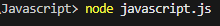
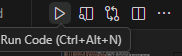

# 🧠 JS for nybegynnere

## Innholdsfortegnelse

1. [Del 1 – Komme i gang, Variabler og Konsoll](#del-1--komme-i-gang-variabler-og-konsoll)
2. [Del 2 – Datatyper og Operatorer](#del-2--datatyper-og-operatorer)
3. [Del 3 – Arrays](#del-3--arrays)
4. [Del 4 – Kontrollflyt og Beslutningstaking](#del-4--kontrollflyt-og-beslutningstaking)
5. [Del 5 – Funksjoner: Koden som gjør jobben](#del-5--funksjoner-koden-som-gjør-jobben)

---

## 🎯 Læringsmål pr. Del

| Del | Hovedtema                          | Mål                                                                |
| --- | ---------------------------------- | ------------------------------------------------------------------ |
| 1   | Introduksjon, variabler og konsoll | Forstå hva JavaScript er, bruke konsollen og lage/endre variabler. |
| 2   | Datatyper og operatorer            | Kjenne til vanlige datatyper og bruke operatorer i uttrykk.        |
| 3   | Arrays                             | Lage lister, hente ut verdier, endre dem og bruke vanlige metoder. |
| 4   | Kontrollflyt og beslutningstaking  | Styre koden med if/else, switch, løkker og logiske betingelser.    |
| 5   | Funksjoner                         | Lage, kalle og bruke funksjoner som tar inn verdier og returnerer. |

**Kilder:**

- W3Schools JavaScript Tutorial
- JavaScript Tutorial (YouTube)

---

## Del 1 – Komme i gang, Variabler og Konsoll

Når du begynner med JavaScript, er det viktig å forstå hvordan du lagrer og viser informasjon.  
Dette gjøres ved hjelp av **variabler** og **konsollen**.

En variabel er som en boks som lagrer informasjon.  
Vi bruker variabler for å holde på data som vi senere kan bruke eller endre i koden.

### Opprette variabler

- `const` – for verdier som **ikke skal endres**
- `let` – for verdier som **kan endres**
- `var` – eldre metode som bør unngås i moderne kode

Konsollen (`console.log()`) brukes til å skrive ut meldinger, teste ideer og feilsøke kode.

JavaScript kjøres vanligvis i nettleseren (klientside), men kan også kjøres på servere ved hjelp av **Node.js**.

**Kjøring** Må være i riktig mappe:



Eller bruke extension **code runner** :



### Variabler og Konsoll

| Emne          | Forklaring                                        | Syntaks                |
| ------------- | ------------------------------------------------- | ---------------------- |
| console.log() | Viser meldinger i konsollen.                      | Console.log("Innhold") |
| //            | Kommentar på linje                                | // Kommentar           |
| /\* \*/       | Kommentar på flere linjer                         | /\* Kommentar \*/      |
| let x         | Lagrer en variabel som kan endres på              | `let` variabelnavn;    |
| const x       | Lagrer en variabel som ikke kan endres            | `const` variabelnavn;  |
| var x         | Utdatert måte å lagre variabler på, unngå å bruke | `var` variabelnavn;    |

#### Skrive ut i konsoll

```js
console.log("Hello world");
```

| Skriver ut: Hello world. |

#### Definere const

```js
const x = 0.25;
// Viktig kan ikke endres
// x = 0.3; Ikke lov!!
```

| Kan ikke endres. |

#### Definere let

```js
let antall = 5;
antall = 7; // Kan endres
```

| Verdien endres fra 5 til 7. |

#### Unngå var

```js
var gammel = "unngås";
```

| var | Eldre metode. |
| Fungerer, men frarådes. |

#### Skrive ut med variabler og sette sammen med bruk av `+` tegnet

```js
let Alder = 24;
let Navn = "Marius";

console.log("Jeg heter" + Navn + "Og er " + Alder + " år gammel");
```

#### Bruke variabler direkte inn i setninger. NB Bruker \` \` istedet for valige "" eller ''

```js
let Alder = 24;
let Navn = "Marius";

console.log(`Jeg heter ${Navn} og er ${Alder} år gammel`);
```

### Oppgaver

| Vanskelighetsgrad | Oppgave                                                                                                  | Tema             |
| ----------------- | -------------------------------------------------------------------------------------------------------- | ---------------- |
| Lett              | Skriv `console.log("Hei, jeg lærer meg JavaScript!")`. Lag en variabel med ditt fornavn og skriv den ut. | console.log, let |
| Lett              | Lag to `const`-verdier for dag og måned og skriv dem ut i én linje.                                      | const            |
| Middels           | Lag en `let`-variabel `alder`, endre verdien og skriv den ut.                                            | let              |
| Middels           | Lag `const MVA` og `let pris`. Beregn totalpris og skriv ut.                                             | const, let       |
| Utfordrende       | Bytt verdiene mellom to variabler `a` og `b`.                                                            | variabler        |
| Utfordrende       | Skriv ut samme tekst med både `var`, `let` og `const`. Forklar forskjellen.                              | var, let, const  |
| Bonus             | Bruk `typeof` for å skrive ut datatyper.                                                                 | typeof           |

---

## Del 2 – Datatyper og Operatorer

Datatyper beskriver hvilken type informasjon du jobber med, og **operatorer** lar deg utføre operasjoner som beregning og sammenligning.

### Vanlige datatyper

- **Number** – Tall, både heltall og desimaler (f.eks. 3 og 3.14)
- **String** – tekst, enten med doble eller enkle anførselstegn ("tekst" eller 'tekst')
- **Boolean** – sann/usann også kjent som `true` eller `false`
- **undefined** – ariabel uten verdi (`undefined`)
- **null** – bevisst tom verdi
- **Array** – Array: liste av verdier (f.eks. `[1, 2, 3]`) - NB: arrays kan inneholde ulike datatyper.
- **Object** – samling av nøkkel-verdi-par (f.eks. `{ navn: "Jo", alder: 17 }`)

```js
let heltall = 10; //heltall
let desimaltall = 99.5; //desimaltall
let tekst1 = "tekst"; // Streng måte 1
let tekst2 = "tekst"; //Streng måte 2
let boolean = true; //True eller false verdi
let udefinert = undefined; // Udefinert verdi
let tom = null; // Tom verdi

let liste = [1, 2, 3]; // Liste, kommer mer senere

let objekt = { navn: "Pc", pris: 10 }; // Objekt, kommer mer senere
```

### Operatorer

- **Aritmetiske:** `+ - * / % **`
- **Strengoperator:** `+` for tekst
- **Tilordning:** `=, +=, -=` for å endre verdier

| Emne                   | Forklaring                                                          | Syntaks                       |
| ---------------------- | ------------------------------------------------------------------- | ----------------------------- |
| Aritmestiske: \* / + - | Sier seg selv: `Matematikk`                                         | let resultat = a (operator) b |
| Modulo: **%**          | Gir rest av noe, eksempel finne ut om noe er partall eller oddetall | 23 % 5 = 3                    |
| Eksponent: **\*\***    | Eksponent av noe, 5^2 === 5 \*\* 2                                  | let kvadrat = 5 \*\* 2;       |
| =                      | Tilordning av verdi                                                 | let x = 10;                   |
| =                      | Legger en verdi til seg selv.                                       | x += verdi;                   |
| =                      | Trekker fra en verdi og oppdaterer variabelen.                      | x -= verdi;                   |
| \*/% =                 | Samme ^^                                                            | (x *= 2) === (x = x*2)        |

### Eksempler

```js
let rest = 10 % 3;
console.log(rest); // 1

let kvadrat = 5 ** 2;
console.log(kvadrat); // 25

let poeng = 5; // setter verdi til 5
poeng = 10; // tilordner variabel x med ny verdi 10
poeng += 5; // betyr det samme som poeng = poeng + 5
console.log(poeng); // 15
```

---

### Oppgaver

| Vanskelighetsgrad | Oppgave                                                           | Tema                |
| ----------------- | ----------------------------------------------------------------- | ------------------- |
| Lett              | Lag en `Number` og en `String` og skriv dem ut sammen.            | Number, String      |
| Lett              | Lag en tekst med _template literal_ som inkluderer navn og alder. | String              |
| Middels           | Beregn antall sekunder i et døgn.                                 | Arithmetic          |
| Middels           | Bruk modulus (`%`) for å finne resten når 23 deles på 5.          | Arithmetic          |
| Utfordrende       | Lag en enkel MVA-kalkulator.                                      | Arithmetic, toFixed |
| Utfordrende       | Undersøk forskjellen mellom `null` og `undefined`.                | null, undefined     |
| Bonus             | Test forskjellige operatorer (+ − \* /).                          | Operators           |

---

## 🧩 Del 3 – Arrays

En **array** er en liste med mange verdier – for eksempel tall, navn eller objekter.  
Et **array** er en ordnet liste over verdier.  
Hver verdi i et array har en **indeks**, som starter på **0**.

| Tema  | Forklaring                                                             | Syntaks                               |
| ----- | ---------------------------------------------------------------------- | ------------------------------------- |
| `[ ]` | En liste defineres med klammeparenteser. Elementene skilles med komma. | `let liste = [element, element, ...]` |

---

### 🔹 Posisjoner og indekser

En liste starter alltid i posisjon 0.  
Posisjonen får du ved å skrive `liste[posisjon]`.

```js
let liste = ["eple", "banan", "kiwi"];
console.log(liste[0]); // Skriver ut "eple"
```

Du kan også bruke samme logikk på **strenger**:

```js
let navn = "Marius";
console.log(navn[0]); // Skriver ut "M"
```

---

### 🔹 Iterasjon (gå gjennom en liste)

```js
const frukter = ["eple", "banan", "kiwi"];

// Med for-løkke
for (let i = 0; i < frukter.length; i++) {
  console.log(frukter[i]);
}

// Med for...of-løkke
for (const frukt of frukter) {
  console.log(frukt);
}
```

---

## ⚙️ Nyttige array-egenskaper og metoder

Her er en oversikt over de mest brukte kommandoene for arrays i JavaScript 👇

| Metode / Egenskap        | Forklaring                                                 | Eksempel                            | Resultat                                |
| ------------------------ | ---------------------------------------------------------- | ----------------------------------- | --------------------------------------- |
| `.length`                | Gir antall elementer i listen                              | `frukter.length`                    | `3`                                     |
| `.push()`                | Legger til et element **på slutten** av listen             | `frukter.push("appelsin")`          | `["eple", "banan", "kiwi", "appelsin"]` |
| `.pop()`                 | Fjerner det **siste** elementet i listen                   | `frukter.pop()`                     | `["eple", "banan"]`                     |
| `.unshift()`             | Legger til et element **i starten** av listen              | `frukter.unshift("druer")`          | `["druer", "eple", "banan", "kiwi"]`    |
| `.shift()`               | Fjerner det **første** elementet i listen                  | `frukter.shift()`                   | `["banan", "kiwi"]`                     |
| `.indexOf()`             | Finner **posisjonen** til et element                       | `frukter.indexOf("kiwi")`           | `2`                                     |
| `.includes()`            | Sjekker om et element **finnes** i listen                  | `frukter.includes("banan")`         | `true`                                  |
| `.slice(start, end)`     | Kopierer deler av en liste (uten å endre originalen)       | `frukter.slice(0, 2)`               | `["eple", "banan"]`                     |
| `.splice(start, antall)` | Fjerner (eller legger til) elementer i en liste            | `frukter.splice(1, 1)`              | Fjerner `"banan"`                       |
| `.join()`                | Slår sammen elementene til en streng                       | `frukter.join(", ")`                | `"eple, banan, kiwi"`                   |
| `.concat()`              | Slår sammen to lister til én                               | `[1, 2].concat([3, 4])`             | `[1, 2, 3, 4]`                          |
| `.reverse()`             | Snu rekkefølgen på elementene                              | `frukter.reverse()`                 | `["kiwi", "banan", "eple"]`             |
| `.sort()`                | Sorterer elementene alfabetisk                             | `frukter.sort()`                    | `["banan", "eple", "kiwi"]`             |
| `.map()`                 | Lager en **ny** liste basert på alle elementene            | `[1, 2, 3].map(x => x * 2)`         | `[2, 4, 6]`                             |
| `.filter()`              | Filtrerer ut elementer som **oppfyller en betingelse**     | `[1, 2, 3, 4].filter(x => x > 2)`   | `[3, 4]`                                |
| `.reduce()`              | Reduserer listen til én verdi (f.eks. summen av alle tall) | `[1, 2, 3].reduce((a, b) => a + b)` | `6`                                     |

---

### 💡 Kombinasjonseksempler

#### Legge til og fjerne elementer

```js
let dyr = ["hund", "katt"];
dyr.push("fugl"); // ["hund", "katt", "fugl"]
dyr.pop(); // ["hund", "katt"]
dyr.unshift("ku"); // ["ku", "hund", "katt"]
dyr.shift(); // ["hund", "katt"]
```

#### Filtrere og telle

```js
let tall = [3, 8, 12, 5, 9];
let over5 = tall.filter((t) => t > 5);
console.log(over5.length); // 3
```

#### Slå sammen to lister

```js
let a = ["eple", "banan"];
let b = ["kiwi", "druer"];
let frukt = a.concat(b);
console.log(frukt); // ["eple", "banan", "kiwi", "druer"]
```

---

### 🧠 Oppgaver

| Vanskelighetsgrad | Oppgave                                                                | Tema           |
| ----------------- | ---------------------------------------------------------------------- | -------------- |
| **Lett**          | Lag en liste med tre navn og skriv ut det første og siste navnet.      | index, console |
| **Lett**          | Bruk `.length` for å skrive ut hvor mange elementer det er i en liste. | length         |
| **Middels**       | Legg til og fjern elementer med `push()` og `pop()`.                   | push, pop      |
| **Middels**       | Sjekk om `"banan"` finnes i en liste med `.includes()`.                | includes       |
| **Utfordrende**   | Bruk `splice()` til å fjerne det midterste elementet i en liste.       | splice         |
| **Utfordrende**   | Bruk `filter()` til å lage en ny liste med bare tall større enn 50.    | filter         |
| **Bonus**         | Slå sammen to arrays og sorter dem alfabetisk.                         | concat, sort   |

---

## Del 4 – Kontrollflyt og Beslutningstaking

**Kontrollflyt** handler om hvordan programmet bestemmer hva som skal skje.

Kontrollstrukturer i JavaScript brukes til å styre flyten av programmet basert på `betingelser` og `gjentakelser`. De vanligste kontrollstrukturene inkluderer valgsetninger (`if-else`- og `switch`-setninger), og løkker (`for`, `while`, `do-while`).

Styres basert på betingelser, betingelsene er inne i paranteser **(`Betingelse`)**
I betingelsene bruker vi ofte sammenlignings operatorer

### Sammenlignings- og logiske operatorer

| Sammenlignings operatorer | Forklaring                                                              | Eksempel                                      |
| ------------------------- | ----------------------------------------------------------------------- | --------------------------------------------- |
| `==` / `===`              | Sammenligner verdier (og type med `===`).                               | `"5" == 5 // true`, `"5" === 5 // false`      |
| `!=` / `!==`              | Ulikhet (Tenk ikke, !Sant betyr Usant ).                                | `10 != "10" // false` , `10 !== "10" // True` |
| `>` `<` `>=` `<=`         | Sammenligner tall. Matematiske operasjoner                              | `let a = 15 > 10;`                            |
| `&&`                      | Betyr og, tenke sammensetting av ting, begge påstander må være sann     | a **&&** b                                    |
| `\|\|`                    | Betyr eller, tenke sammensetting av ting, en av påstandene må være sann | a **\|\|** b                                  |

---

## If-else-setninger

Med `if`, `else if` og `else` kan du få koden til å reagere på situasjoner.

**If-else-setninger** brukes til å utføre kode basert på om en betingelse er sann eller usann.

```js
let tall = 5;

if (tall > 10) {
  console.log("Tallet er større enn 10");
} else {
  console.log("Tallet er 10 eller mindre");
}
```

👉 Merk at du ikke skriver en test for `else`, siden `else` fanger opp alle andre tilfeller når `if`-betingelsen er falsk.

---

### Flere alternativer med `else if`

```js
let tall = 7;

if (tall > 10) {
  console.log("Tallet er større enn 10");
} else if (tall === 10) {
  console.log("Tallet er lik 10");
} else {
  console.log("Tallet er mindre enn 10");
}
```

---

### Kombinere flere betingelser

Du kan bruke **logiske operatorer** som `&&` (og) og `||` (eller):

```js
let tall = 5;

if (tall > 0 && tall < 10) {
  console.log("Tallet er mellom 0 og 10");
}

if (tall < 0 || tall > 10) {
  console.log("Tallet er enten mindre enn 0 eller større enn 10");
}
```

---

### Ternary operator `? :`

Gir en kortere syntaks for enkle if-else-setninger:

```js
let tall = 5;
let resultat = tall > 10 ? "Større enn 10" : "10 eller mindre";
console.log(resultat); // Skriver "10 eller mindre"
```

---

## 🔀 Switch-setninger

**Switch-setninger** brukes til å velge mellom flere alternativer basert på verdien av en variabel.

```js
let frukt = "eple";

switch (frukt) {
  case "banan":
    console.log("Dette er en banan.");
    break;
  case "eple":
    console.log("Dette er et eple.");
    break;
  default:
    console.log("Ukjent frukt.");
}
```

💡 Merk:

- Hver `case` avsluttes med `break` for å forhindre at koden "faller gjennom" til neste.
- `default` fungerer som en "else" hvis ingen case passer.

**Når bruker du hva?**  
👉 `if-else` passer best for **få og dynamiske** betingelser.  
👉 `switch` passer best for **mange faste** alternativer.

---

## 🔁 Løkker

**Løkker** brukes til å gjenta kode flere ganger.  
De vanligste i JavaScript er `for`, `while` og `do-while`.

---

### 🔹 For-løkke

```js
for (let i = 0; i < 5; i++) {
  console.log("Teller: " + i);
}
```

Eller for å gå gjennom en array:

```js
let frukter = ["eple", "banan", "appelsin"];

for (let i = 0; i < frukter.length; i++) {
  console.log("Frukt: " + frukter[i]);
}
```

---

### 🔹 For...of-løkke

```js
let frukter = ["eple", "banan", "appelsin"];

for (let frukt of frukter) {
  console.log("Frukt: " + frukt);
  // NB: Du kan hente indeks med frukter.indexOf(frukt)
}
```

---

### 🔹 For...in-løkke

```js
let frukter = ["eple", "banan", "appelsin"];

for (let indeks in frukter) {
  console.log("Frukt: " + frukter[indeks]);
}
```

Forskjellen:

| Løkke      | Itererer over | Eksempel                      |
| ---------- | ------------- | ----------------------------- |
| `for...of` | verdiene      | `"eple", "banan", "appelsin"` |
| `for...in` | indeksene     | `"0", "1", "2"` (strings)     |

```js
const arr = ["a", "b", "c"];

for (let v of arr) console.log("value:", v);
for (let i in arr) console.log("index:", i, "value:", arr[i]);
```

---

### 🔹 forEach-løkke

```js
let studenter = [
  { navn: "Ola", poeng: 85 },
  { navn: "Kari", poeng: 92 },
  { navn: "Per", poeng: 78 },
];

studenter.forEach(function (student) {
  console.log(student.navn + " har " + student.poeng + " poeng.");
});

// Eller med arrow function:
studenter.forEach((student) => {
  console.log(`${student.navn} har ${student.poeng} poeng.`);
});
```

Samme kan gjøres med `for...of`:

```js
for (const student of studenter) {
  console.log(`${student.navn} har ${student.poeng} poeng.`);
}
```

---

### 🔹 While-løkke

```js
let i = 0;
while (i < 5) {
  console.log("Teller: " + i);
  i++;
}
```

⚠️ Pass på uendelige løkker! Sørg for at betingelsen blir **falsk** til slutt.

---

### 🔹 Do-while-løkke

```js
let j = 0;
do {
  console.log("Teller: " + j);
  j++;
} while (j < 5);
```

`do-while` kjører alltid **minst én gang**, fordi testen skjer **etterpå**.

```js
let input;
do {
  input = prompt("Skriv 'exit' for å avslutte.");
  console.log("Du skrev: " + input);
} while (input !== "exit");
```

---

## ⏹ Bryte ut av løkker

Du kan stoppe eller hoppe over deler av en løkke med `break` og `continue`.

```js
for (let i = 0; i < 5; i++) {
  if (i === 2) continue; // hopper over 2
  console.log("Teller: " + i);
}

for (let i = 0; i < 5; i++) {
  if (i === 3) break; // stopper helt når i = 3
  console.log("Teller: " + i);
}
```

---

## 🧩 Oppsummering

Kontrollstrukturer styrer **flyten** i programmet ditt.  
De lar deg:

- utføre kode basert på betingelser (`if`, `else`, `switch`)
- gjenta kode (`for`, `while`, `do-while`, `forEach`)
- kontrollere utførelsen (`break`, `continue`)

---

### Oppgaver

| Vanskelighetsgrad | Oppgave                                                | Tema           |
| ----------------- | ------------------------------------------------------ | -------------- | --- | ----------- |
| Lett              | Sjekk om en person er gammel nok til å kjøre bil.      | if/else        |
| Lett              | Sjekk om et tall er større enn 100.                    | if             |
| Middels           | Lag et værvarsel som bruker både `&&` og `             |                | `.  | if, logical |
| Middels           | Lag et poengsystem med if/else if/else for karakterer. | else if        |
| Utfordrende       | Lag et passord-sjekkskript med `!==` og `.length`.     | comparison     |
| Utfordrende       | Sjekk om to verdier er like både i verdi og type.      | ===            |
| Bonus             | Lag en mini-kalkulator med if/else.                    | if, operatorer |

---

## 🔁 Oppgaver – Løkker

### 🔹 For-løkke

| Vanskelighetsgrad | Oppgave                                                              | Tema             |
| ----------------- | -------------------------------------------------------------------- | ---------------- |
| **Lett**          | Skriv ut tallene 1–10 med en for-løkke.                              | for              |
| **Lett**          | Skriv ut alle partall mellom 0 og 20.                                | for, modulus     |
| **Middels**       | Summer alle tallene fra 1 til 100.                                   | for, sum         |
| **Middels**       | Lag en for-løkke som teller baklengs fra 10 til 0.                   | for              |
| **Utfordrende**   | Lag et program som skriver ut gangetabellen (for eksempel 7-gangen). | for, nested loop |
| **Bonus**         | Lag en dobbel for-løkke som tegner et rutenett med `*` i konsollen.  | for, nested loop |

---

### 🔹 For...of og forEach

| Vanskelighetsgrad | Oppgave                                                                                                | Tema           |
| ----------------- | ------------------------------------------------------------------------------------------------------ | -------------- |
| **Lett**          | Lag en array med navn og skriv ut alle navnene med `for...of`.                                         | for...of       |
| **Middels**       | Lag en array med tall og bruk `for...of` til å finne summen.                                           | for...of       |
| **Middels**       | Bruk `forEach` til å skrive ut alle elementene i en handleliste.                                       | forEach        |
| **Utfordrende**   | Bruk `forEach` til å telle hvor mange tall i en liste som er større enn 50.                            | forEach, if    |
| **Bonus**         | Bruk `forEach` sammen med en arrow-funksjon for å skrive ut “Hei, [navn]!” for hver person i en array. | forEach, arrow |

---

### 🔹 While og Do-While

| Vanskelighetsgrad | Oppgave                                                                                                          | Tema                 |
| ----------------- | ---------------------------------------------------------------------------------------------------------------- | -------------------- |
| **Lett**          | Lag en while-løkke som teller fra 1 til 5.                                                                       | while                |
| **Lett**          | Lag en while-løkke som teller ned fra 10 til 1.                                                                  | while                |
| **Middels**       | Be brukeren om å skrive inn et tall med `prompt()` helt til de skriver 0.                                        | while, input         |
| **Middels**       | Lag en do-while som kjører minst én gang og spør brukeren om å skrive "exit" for å avslutte.                     | do-while             |
| **Utfordrende**   | Kombiner `while` og `if` for å skrive ut bare partall mellom 1 og 20.                                            | while, if            |
| **Bonus**         | Lag et lite spill der programmet velger et tilfeldig tall (1–10), og brukeren må gjette riktig i en while-løkke. | while, random, input |

---

### 🔹 Break og Continue

| Vanskelighetsgrad | Oppgave                                                                                | Tema              |
| ----------------- | -------------------------------------------------------------------------------------- | ----------------- |
| **Lett**          | Lag en for-løkke som teller fra 1 til 10, men hopper over tallet 5.                    | for, continue     |
| **Middels**       | Lag en for-løkke som avsluttes når `i` blir 7.                                         | for, break        |
| **Utfordrende**   | Kombiner `while` med `break` for å avbryte et spill når brukeren skriver “exit”.       | while, break      |
| **Bonus**         | Bruk både `continue` og `break` i samme løkke for å hoppe over partall og stoppe på 9. | for, control flow |

## Del 5 – Funksjoner: Koden som gjør jobben

Funksjoner er blokker med kode som kan gjenbrukes flere ganger i stedet for å kopiere samme kode om og om igjen.

En funksjon kan:

- kjøre kode når du kaller den
- ta inn verdier (parametere)
- gi tilbake et resultat (`return`)
- ha sitt eget “område” (scope)

---

### Grunnleggende funksjon

Den enkleste formen er:

1. definere funksjonen
2. kalle den

```js
function siHei() {
  console.log("Hei!");
}

siHei(); // Kaller funksjonen
```

Her defineres `siHei()`, og så kjører vi den ved å skrive `siHei()`.

---

### Funksjoner med parametere

En funksjon kan ta inn data som den bruker inni seg. Disse verdiene kalles **parametere**.

```js
function siHeiTilNavn(navn) {
  console.log("Hei, " + navn + "!");
}

siHeiTilNavn("Ola"); // Skriver "Hei, Ola!"
```

Her er `navn` en parameter. Når vi kaller funksjonen, sender vi inn `"Ola"`.

---

### Funksjoner som returnerer en verdi

Funksjoner kan også gi tilbake (returnere) et resultat du kan bruke senere.

```js
function leggSammen(a, b) {
  return a + b;
}

let resultat = leggSammen(3, 4);
console.log(resultat); // 7
```

Forklaring:

- `return a + b;` sender verdien ut av funksjonen
- `resultat` får verdien 7 når vi kaller `leggSammen(3, 4)`

---

### Omfang (scope)

Variabler som lages inni en funksjon er **bare synlige inni den funksjonen**.

```js
function testOmfang() {
  let x = 10;
  console.log(x); // 10
}

testOmfang();

console.log(x); // ReferenceError: x is not defined
```

`x` finnes kun inne i `testOmfang()`. Utenfor er den "usynlig".

Dette kalles **scope**.

---

### Pilfunksjoner (arrow functions)

Pilfunksjoner er en mer moderne og kortere måte å skrive funksjoner på.

```js
const siHei = () => {
  console.log("Hei!");
};

siHei();
```

De kan også ta parameter(e):

```js
const siHeiTilNavn = (navn) => {
  console.log("Hei, " + navn + "!");
};

siHeiTilNavn("Ola");
```

Og de kan returnere en verdi. Hvis funksjonen bare består av ett uttrykk, kan du skrive det ekstremt kompakt:

```js
const leggSammen = (a, b) => a + b;

let resultat = leggSammen(3, 4);
console.log(resultat); // 7
```

Legg merke til:

- Ingen `{ }`
- Ingen `return`
- Den returnerer automatisk resultatet av `a + b`

Enda et eksempel på pilfunksjon som gjør noe og returnerer noe:

```js
const doble = (tall) => tall * 2;

console.log(doble(10)); // 20
```

---

### Anonyme funksjoner og callback-funksjoner

En funksjon trenger ikke alltid et navn. En **anonym funksjon** er en funksjon uten navn.

Disse brukes ofte som **callback** – altså en funksjon du sender inn til en annen funksjon for at den skal kjøre senere.

```js
setTimeout(() => {
  console.log("Dette er en callback-funksjon");
}, 1000);
```

`setTimeout` får:

- en funksjon som skal kjøre
- et antall millisekunder å vente (1000 ms = 1 sekund)

Samme ting med “gammel” syntaks:

```js
setTimeout(function () {
  console.log("Dette er en callback-funksjon");
}, 1000);
```

Forskjellen her er bare at i den første versjonen brukte vi en pilfunksjon `() => { ... }`,
og i den andre en vanlig `function() { ... }`.

---

### Samleeksempel

Under ser du flere konsepter på en gang:

```js
function siHei(navn) {
  console.log("Hei, " + navn);
}

function leggSammen(a, b) {
  return a + b;
}

const doble = (tall) => tall * 2;

siHei("Jonas"); // "Hei, Jonas"
console.log(leggSammen(2, 5)); // 7
console.log(doble(10)); // 20
```

---

### Oppsummering

- En funksjon er en gjenbrukbar kodeblokk.
- Du kaller den ved å skrive navnet + `()`.
- Den kan ta inn parametere.
- Den kan `returnere` en verdi tilbake.
- Variabler inni funksjonen lever bare der (scope).
- Pilfunksjoner (`const navn = () => { ... }`) er kortere og brukes mye i moderne JS.
- Du kan sende funksjoner inn i andre funksjoner → callback.

---

### Oppgaver

| Vanskelighetsgrad | Oppgave                                                                                | Tema            |
| ----------------- | -------------------------------------------------------------------------------------- | --------------- |
| Lett              | Lag en funksjon `hilsen()` som skriver ut en melding i konsollen.                      | funksjon        |
| Lett              | Lag en funksjon som skriver ut dagens dato (bruk `new Date()`).                        | funksjon        |
| Middels           | Lag en pilfunksjon `areal(bredde, høyde)` som returnerer arealet.                      | arrow function  |
| Middels           | Lag en funksjon `sum(a, b)` som returnerer summen av to tall.                          | return          |
| Middels           | Lag en funksjon `erMyndig(alder)` som returnerer `true/false`.                         | if, return      |
| Utfordrende       | Lag en funksjon `prisMedRabatt(pris, rabattProsent)` som regner ny pris.               | if, funksjon    |
| Utfordrende       | Lag en funksjon `snitt(liste)` som tar en array med tall og returnerer gjennomsnittet. | array, funksjon |
| Bonus             | Lag en funksjon `celsiusTilFahrenheit(c)` som returnerer Fahrenheit.                   | matematikk      |
| Bonus             | Bruk `setTimeout` med en anonym pilfunksjon som skriver "Ferdig!" etter 2 sekunder.    | callback, arrow |

## Del 6 – Objekter og navigering
