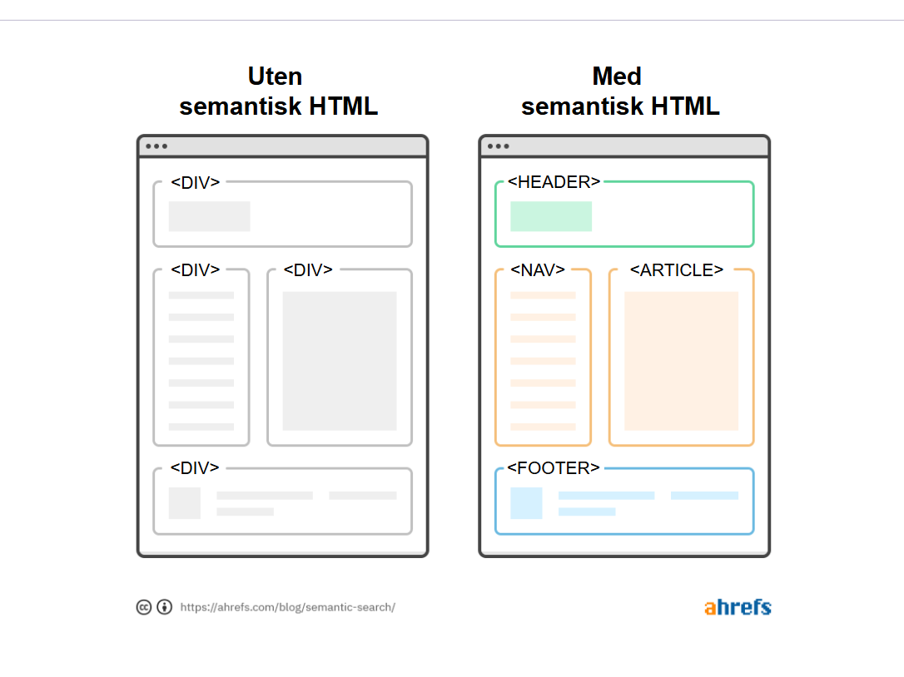

# Semantisk HTML

## Hva betyr semantikk?
- *Semantikk* handler om **mening**.  
- I HTML betyr semantikk at vi bruker elementer som **forteller hva innholdet er**, ikke bare hvordan det skal se ut.

---

## Hvorfor bruke semantisk HTML?
1. **Struktur og lesbarhet**
   - Koden blir enklere å lese og forstå, både for utviklere og maskiner.
   - Man ser raskt hvilken rolle et element har i dokumentet.

2. **Tilgjengelighet**
   - Skjermlesere og andre hjelpemidler kan tolke innholdet riktig.
   - Brukere med funksjonsnedsettelser får bedre opplevelse.

3. **Søkemotoroptimalisering (SEO)**
   - Søkemotorer som Google kan forstå innholdet bedre og indeksere det mer nøyaktig.

4. **Vedlikehold og gjenbruk**
   - Det er lettere å videreutvikle og style en side når strukturen er logisk og semantisk.

---

## Forskjellen på semantisk og ikke-semantisk HTML
- **Ikke-semantiske elementer:** `<div>`, `<span>`
  - Sier ingenting om innholdet, brukes kun som “bokser”.
- **Semantiske elementer:** `<article>`, `<nav>`, `<section>`, `<footer>`, `<header>`
  - Forteller hvilken rolle innholdet har.

### Eksempel
```html
<!-- Ikke-semantisk -->
<div class="header">
  <h1>Nyhetsartikkel</h1>
</div>
<div class="content">
  <p>Dette er innholdet i artikkelen.</p>
</div>

<!-- Semantisk -->
<article>
  <header>
    <h1>Nyhetsartikkel</h1>
  </header>
  <p>Dette er innholdet i artikkelen.</p>
</article>
```

 

## Vanlige semantiske elementer i HTML5

| Element     | Bruksområde                                                                 |
|-------------|------------------------------------------------------------------------------|
| `<header>`  | Toppseksjon på side eller seksjon. Inneholder ofte logo, tittel, navigasjon. |
| `<nav>`     | Navigasjonslenker (menyer, lister med linker).                               |
| `<main>`    | Hovedinnholdet på siden (skal bare finnes én per side).                      |
| `<section>` | En tematisk seksjon, ofte med overskrift.                                    |
| `<article>` | Selvstendig innhold som kan stå alene (f.eks. blogginnlegg, nyhetsartikkel). |
| `<aside>`   | Tilleggsinnhold, sidefelt eller ekstra informasjon.                          |
| `<footer>`  | Bunntekst for en side eller seksjon (f.eks. kontaktinfo, opphavsrett).       |

---

## Prinsipper for god semantisk HTML

- Bruk elementer etter deres **betydning**, ikke etter utseende.  
  *(Utseende styres av CSS, ikke av HTML.)*

- Bruk overskrifter `<h1>`–`<h6>` i riktig hierarki.  
  - Én `<h1>` for hovedtittelen, deretter underoverskrifter i synkende nivå.

- Bruk `<p>` for avsnitt, ikke bare `<br>` for linjeskift.

- Ikke bruk `<div>` og `<span>` unødvendig når det finnes semantiske alternativer.

- Tenk at HTML-en er et **skjelett** som gir struktur, mens CSS og JavaScript gir utseende og funksjonalitet.

---

## Oppsummert

- Semantisk HTML gjør koden **tydeligere, mer tilgjengelig og mer søkemotorvennlig**.  
- Bruk riktige elementer for å beskrive innholdets **mening og rolle**.  
- Husk:  
  - HTML gir **struktur**  
  - CSS gir **stil**  
  - JavaScript gir **interaktivitet**

